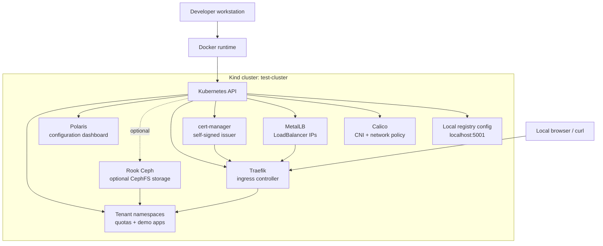

# Kubernetes Cluster Development

A local Kubernetes platform lab built on [Kind](https://kind.sigs.k8s.io/). The repository provisions a development cluster with networking, ingress, TLS, storage, policy visibility, and optional tenant/multi-cluster workflows.

The default cluster is intended for local experimentation, platform engineering demos, and validating Kubernetes add-ons before moving them into a shared environment.

## Architecture



## What This Installs

| Component | Purpose | Installed by default |
| --- | --- | --- |
| Kind | Local Kubernetes cluster running in Docker | Yes |
| Local registry config | Announces a development registry host at `localhost:5001` | Yes |
| Calico | CNI and network policy support | Yes |
| MetalLB | `LoadBalancer` IP allocation for local bare-metal style testing | Yes |
| cert-manager | Local certificate automation with a self-signed `ClusterIssuer` | Yes |
| Rook Ceph | Ephemeral local CephFS storage via `rook-ceph-filesystem` | Optional |
| Traefik | Ingress controller | Yes |
| Polaris | Kubernetes configuration dashboard | Yes |
| Tenant manifests | Namespace, quota, and demo app workflow | Optional |
| Multi-cluster Kind setup | One platform cluster and two tenant clusters | Optional |
| Prometheus / OAuth manifests | Add-on manifests kept in the repo | Not installed by `start.sh` |

## Prerequisites

Install these tools before running the automation:

- [Docker](https://www.docker.com/)
- [Kind](https://kind.sigs.k8s.io/)
- [kubectl](https://kubernetes.io/docs/tasks/tools/)
- [Skaffold](https://skaffold.dev/)
- [Helm](https://helm.sh/)

Confirm the tools are available:

```bash
docker version
kind version
kubectl version --client
skaffold version
helm version
```

## Quick Start

Create the local platform cluster and install the default add-ons:

```bash
./start.sh
```

The script performs the following high-level sequence:

1. Creates the Kind cluster from `Kind/cluster.yaml`.
2. Applies base Kind resources, including the local-registry discovery config.
3. Installs Calico and waits for Calico pods to become ready.
4. Installs MetalLB and applies `metallb/address-pool.yaml`.
5. Installs cert-manager and applies the self-signed `ClusterIssuer`.
6. Installs Traefik and Polaris.

Check the cluster:

```bash
kubectl get nodes
kubectl get pods --all-namespaces
kubectl get storageclass
```

## Delete the Cluster

Remove the local Kind cluster:

```bash
./delete.sh
```

`delete.sh` also performs best-effort Rook Ceph cleanup if you installed the optional Rook add-on. The cleanup avoids deleting Rook custom resources through manifest files after their CRDs are gone, which prevents `no matches for kind "CephCluster"` errors during teardown.

## Rook Ceph Storage

Rook Ceph is optional and is not installed by `./start.sh`. Install it only when you need a Ceph-backed storage lab:

```bash
cd rook-ceph
./install.sh
```

The standalone installer applies the Rook CRDs, operator, Ceph cluster, CephFS filesystem, and the `rook-ceph-filesystem` `StorageClass`.

This repo uses CephFS by default because Docker Desktop's LinuxKit kernel does not include the `rbd` kernel module required by the RBD CSI node plugin. The CephFS CSI driver runs with the fuse client for better local compatibility.

Example PVC:

```yaml
apiVersion: v1
kind: PersistentVolumeClaim
metadata:
  name: demo-pvc
spec:
  accessModes:
    - ReadWriteOnce
  resources:
    requests:
      storage: 1Gi
  storageClassName: rook-ceph-filesystem
```

Uninstall only Rook Ceph without deleting the whole Kind cluster:

```bash
cd rook-ceph
./uninstall.sh
```

## Ingress and Local HTTPS

Traefik is installed as the ingress controller. cert-manager installs a self-signed `ClusterIssuer` named `selfsigned` for local HTTPS testing.

Useful checks:

```bash
kubectl get svc -n traefik
kubectl get clusterissuer
kubectl get certificate --all-namespaces
```

When using self-signed certificates, test HTTPS endpoints with `curl -k`.

```bash
curl -k https://app.tenant-a.127.0.0.1.nip.io
```

### macOS MetalLB Note

MetalLB allocates IPs from `172.18.255.200-172.18.255.250`. On macOS, these Docker network IPs are often not directly reachable from the host. If DNS resolves but requests hang, use a `kubectl port-forward`, Kind port mapping, or a localhost-based ingress path for local testing.

## Tenant Workflow

The tenant helper applies platform and tenant namespace resources:

```bash
./tenants.sh
```

Expected tenant routes:

- `https://app.tenant-a.127.0.0.1.nip.io`
- `https://app.tenant-b.127.0.0.1.nip.io`

The script expects these manifests:

- `manifests/tenants.yaml`
- `manifests/tenant-example-apps.yaml`

If those files are not present in your working tree, restore or recreate them before running `./tenants.sh`.

## Multi-Cluster Workflow

The `multi-cluster/` directory creates a local topology with one platform cluster and two tenant clusters.

Create all clusters:

```bash
./multi-cluster/create.sh
```

Created contexts:

- `kind-platform-cluster`
- `kind-tenant-a-cluster`
- `kind-tenant-b-cluster`

Check status:

```bash
./multi-cluster/status.sh
```

Delete all multi-cluster resources:

```bash
./multi-cluster/delete.sh
```

This setup creates baseline namespaces only. To route traffic from a management cluster into tenant clusters, add cross-cluster networking, a service mesh, or explicit external endpoints.

## Repository Layout

| Path | Description |
| --- | --- |
| `Kind/` | Kind cluster config, CoreDNS config, and local-registry discovery resources |
| `calico/` | Calico operator and custom resources |
| `metallb/` | MetalLB installation and local address pool |
| `cert-manager/` | cert-manager install and self-signed issuer |
| `rook-ceph/` | Optional Rook Ceph CRDs, operator, cluster, CephFS StorageClass, install script, and uninstall script |
| `traefik/` | Traefik Skaffold config and Helm values |
| `polaris/` | Polaris Skaffold config and Helm values |
| `prometheus/` | Prometheus add-on manifests |
| `Oauth/` | OAuth add-on manifests |
| `multi-cluster/` | Local platform and tenant Kind cluster automation |
| `start.sh` | Creates the main local platform cluster |
| `delete.sh` | Deletes the main local platform cluster |
| `tenants.sh` | Applies tenant namespace and demo app manifests |

## Troubleshooting

### Rook CRD errors during cleanup

If you see an error similar to:

```text
no matches for kind "CephCluster" in version "ceph.rook.io/v1"
ensure CRDs are installed first
```

the cluster has Rook custom-resource manifests being evaluated after the Rook CRDs were removed. Use the current `delete.sh` or `rook-ceph/uninstall.sh`; both scripts check for CRDs before deleting Rook custom resources.

### RBD CSI plugin crashes on Docker Desktop

If `csi-rbdplugin` fails with:

```text
modprobe: FATAL: Module rbd not found in directory /lib/modules/...-linuxkit
```

the host kernel does not provide the RBD module. The optional Rook manifests disable RBD CSI and use CephFS instead. Recreate the Rook add-on after pulling these changes:

```bash
cd rook-ceph
./uninstall.sh
./install.sh
```

### Calico pods never become ready

Check the Calico namespace:

```bash
kubectl get pods -n calico-system
kubectl describe pod -n calico-system <pod-name>
```

### Ingress host resolves but does not connect

On macOS this is usually Docker network reachability, not DNS. Confirm the Traefik service IP and use port-forwarding if needed:

```bash
kubectl get svc -n traefik
kubectl -n traefik port-forward svc/traefik 8080:80 8443:443
```

## Development Notes

- Changes to `Kind/cluster.yaml`, including `extraPortMappings`, require recreating the Kind cluster.
- The optional Rook Ceph configuration is for local development and should not be treated as production storage.
- `prometheus/` and `Oauth/` contain add-on manifests, but they are not part of the default `./start.sh` path.
